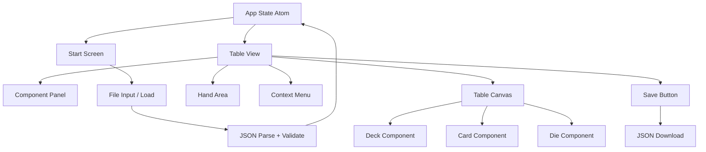

# Design Document: Tabletop Simulator

## Overview

A browser-based 2D top-down tabletop simulator built with ClojureScript, shadow-cljs, Reagent, and Tailwind CSS. The app runs entirely in the browser with no backend — all state lives in a Reagent atom and persistence is handled via local JSON file download/upload.

The UI is a single-page application with two views:
- **Start Screen** — "New Game" / "Load Game" options
- **Table View** — the main play area with a component panel, hand area, and canvas-like table

The table supports pan/zoom via CSS transforms on a container div. Components (cards, decks, dice) are absolutely positioned within the table coordinate space.

### Key Design Decisions

- **No canvas API** — all components are DOM elements styled with Tailwind/CSS, positioned absolutely. This keeps rendering simple and accessible, and makes drag-and-drop straightforward with pointer events.
- **Single atom state** — all app state lives in one `reagent/atom`. This makes serialization trivial (the atom value IS the game state) and keeps the data flow unidirectional.
- **No external drag-and-drop library** — pointer events (`pointerdown`, `pointermove`, `pointerup`) handle drag-and-drop directly, avoiding library overhead and giving full control over the interaction model.
- **Shuffle via Fisher-Yates** — deterministic, unbiased shuffle algorithm.
- **Dice via `js/Math.random`** — uniform distribution, sufficient for tabletop use.

---

## Architecture



### State Flow

```
User Interaction
      │
      ▼
Event Handler (swap! app-state ...)
      │
      ▼
App State Atom (single source of truth)
      │
      ▼
Reagent re-renders affected components
```

### Module Structure

```
src/
  tabletop/
    core.cljs          — entry point, mounts app
    state.cljs         — app-state atom, state helpers
    components/
      app.cljs         — top-level router (start vs table view)
      start_screen.cljs
      table.cljs       — table canvas, pan/zoom
      hand.cljs        — hand area
      deck.cljs        — deck component
      card.cljs        — card component
      die.cljs         — die component
      context_menu.cljs
      component_panel.cljs
      deck_customizer.cljs
    logic/
      shuffle.cljs     — Fisher-Yates shuffle
      dice.cljs        — roll logic
      serialization.cljs — serialize/deserialize game state
      validation.cljs  — save file validation
```

---

## Components and Interfaces

### Start Screen

Renders two buttons. "New Game" resets state to empty table and transitions to table view. "Load Game" triggers a hidden `<input type="file">` click, reads the file, parses JSON, validates, and either restores state or shows an error.

### Table Canvas

A relatively-positioned outer div (viewport) containing an absolutely-positioned inner div (world). The world div is transformed with `translate(panX, panY) scale(zoom)`. All components are children of the world div, positioned by their `[x y]` coordinates.

- **Pan**: `pointerdown` on empty table area starts pan; `pointermove` updates `[panX panY]`; `pointerup` ends pan.
- **Zoom**: `wheel` event updates zoom, clamped to [0.5, 2.0], centered on cursor.

### Component Panel

A sidebar or toolbar listing addable components: Standard Deck, Custom Deck, and each die type (d4, d6, d8, d10, d12, d20, d100). Clicking an item dispatches the appropriate add action.

### Deck Component

Rendered as a stack of card-shaped divs. Shows card count. Right-click opens context menu with "Draw Top Card", "Shuffle", "Flip Deck". Draggable.

### Card Component

Rendered as a div showing rank + suit (face-up) or a back pattern (face-down). Double-click toggles face. Draggable. Right-click shows "Remove".

### Die Component

Rendered as a div showing die type label and current roll result (or neutral state if never rolled). Click triggers roll. Draggable. Right-click shows "Remove".

### Hand Area

A fixed strip at the bottom of the viewport. Cards dragged into this area move from table to hand. Cards in hand are displayed face-up. Dragging a card out of the hand back to the table removes it from hand and places it on the table.

### Context Menu

A floating div rendered at pointer position. Dismissed on click-outside or Escape. Receives a list of `{label action}` items.

### Deck Customizer

A modal form with:
- 4 suit label inputs (max 20 chars each)
- 13 rank label inputs (max 10 chars each)
- Color palette picker (8+ colors)
- Confirm / Cancel buttons
- Inline validation errors

---

## Data Models

All state is a plain ClojureScript map stored in a `reagent/atom`. This map is directly serializable to/from JSON.

### App State Shape

```clojure
{:view        :start | :table

 :table       {:pan-x  number   ; world offset x (pixels)
               :pan-y  number   ; world offset y (pixels)
               :zoom   number}  ; scale factor [0.5, 2.0]

 :components  [component ...]   ; ordered list of all table components

 :hand        [card ...]        ; cards in the hand area

 :context-menu nil | {:x number :y number :items [{:label string :action keyword}]}

 :error       nil | string}     ; start screen error message
```

### Component Types

```clojure
;; Deck
{:id       uuid-string
 :type     :deck
 :x        number
 :y        number
 :cards    [card ...]
 :custom?  boolean
 :suits    [string ...]   ; 4 elements
 :ranks    [string ...]   ; 13 elements
 :color    string}        ; hex color

;; Card (on table, not in deck)
{:id       uuid-string
 :type     :card
 :x        number
 :y        number
 :suit     string
 :rank     string
 :color    string
 :face-up? boolean}

;; Die
{:id       uuid-string
 :type     :die
 :x        number
 :y        number
 :faces    number         ; 4 | 6 | 8 | 10 | 12 | 20 | 100
 :result   nil | number}  ; nil = never rolled
```

### Card (within a Deck's :cards vector)

```clojure
{:id       uuid-string
 :suit     string
 :rank     string
 :color    string
 :face-up? boolean}
```

### Save File Format

The save file is the JSON serialization of the `:table`, `:components`, and `:hand` keys from the app state. The `:view`, `:context-menu`, and `:error` keys are not persisted.

```json
{
  "version": 1,
  "table": { "pan-x": 0, "pan-y": 0, "zoom": 1.0 },
  "components": [...],
  "hand": [...]
}
```

Validation checks: `version` is present and equals 1, `table`/`components`/`hand` are present and correctly typed.

---

## Correctness Properties

*A property is a characteristic or behavior that should hold true across all valid executions of a system — essentially, a formal statement about what the system should do. Properties serve as the bridge between human-readable specifications and machine-verifiable correctness guarantees.*

### Property 1: Standard deck completeness

*For any* call to `add-standard-deck`, the resulting deck SHALL contain exactly 52 cards covering all 4 suits × 13 ranks, with no duplicates.

**Validates: Requirements 3.1, 3.4**

---

### Property 2: Die initial state invariant

*For any* die type N in #{4, 6, 8, 10, 12, 20, 100}, a newly added die SHALL have `:faces` equal to N and `:result` equal to nil.

**Validates: Requirements 3.3, 6.3**

---

### Property 3: Custom deck completeness

*For any* valid custom deck configuration (4 non-empty suit labels, 13 non-empty rank labels, a color), the resulting deck SHALL contain exactly 52 cards where every card's `:suit` is one of the defined suits and every card's `:rank` is one of the defined ranks.

**Validates: Requirements 4.4**

---

### Property 4: Deck config validation rejects empty labels

*For any* deck configuration where at least one suit label or rank label is empty or composed entirely of whitespace, the validation function SHALL return an error and SHALL NOT produce a deck.

**Validates: Requirements 4.5, 1.5**

---

### Property 5: Move updates position without side effects

*For any* component (card or die) on the table and any target position [x, y], after a move operation the component's position SHALL equal [x, y] and all other component fields (face-up state, roll result, etc.) SHALL remain unchanged.

**Validates: Requirements 5.1, 6.4**

---

### Property 6: Card face toggle is an involution

*For any* card, toggling the face-up state twice SHALL return the card to its original `:face-up?` value.

**Validates: Requirements 5.2**

---

### Property 7: Card table ↔ hand round-trip

*For any* card on the table, moving it to the hand and then back to the table SHALL result in the card being present in `:components` and absent from `:hand`, with all card fields preserved.

**Validates: Requirements 5.3, 5.4**

---

### Property 8: Draw top card transfers correctly

*For any* non-empty deck, after `draw-top-card`, the deck's card count SHALL decrease by exactly 1, the hand's card count SHALL increase by exactly 1, and the drawn card SHALL be the card that was previously at the top of the deck.

**Validates: Requirements 5.6**

---

### Property 9: Shuffle preserves card set

*For any* deck, after `shuffle-deck`, the set of card ids in the deck SHALL be identical to the set before shuffling, and the deck size SHALL be unchanged.

**Validates: Requirements 5.7**

---

### Property 10: Flip deck is an involution

*For any* deck, after `flip-deck` applied twice, every card's `:face-up?` value SHALL equal its original value.

**Validates: Requirements 5.8**

---

### Property 11: Die roll result is in valid range

*For any* die with N faces (N ∈ #{4, 6, 8, 10, 12, 20, 100}), after rolling, the `:result` SHALL be an integer in the closed interval [1, N].

**Validates: Requirements 6.1, 6.2**

---

### Property 12: Pan updates viewport offset

*For any* current pan state and any delta [dx, dy], after applying a pan operation, `:pan-x` SHALL increase by dx and `:pan-y` SHALL increase by dy.

**Validates: Requirements 7.1**

---

### Property 13: Zoom is always within bounds

*For any* current zoom value and any scroll delta, after applying a zoom operation, the resulting zoom SHALL be in the closed interval [0.5, 2.0].

**Validates: Requirements 7.2, 7.3**

---

### Property 14: Remove eliminates component

*For any* component present in `:components`, after `remove-component`, that component SHALL no longer appear in `:components`.

**Validates: Requirements 7.5**

---

### Property 15: Serialization round-trip

*For any* valid `Game_State`, serializing it to JSON and then deserializing the result SHALL produce a `Game_State` that is deeply equal to the original, preserving all component positions, face states, roll results, deck compositions, and hand contents.

**Validates: Requirements 8.1, 8.2, 8.3, 8.4, 1.4**

---

## Error Handling

### Invalid Save File

When loading a file, the app validates the parsed JSON before applying it to state. Validation checks:
- Top-level keys `version`, `table`, `components`, `hand` are present
- `version` equals 1
- `table` has numeric `pan-x`, `pan-y`, `zoom`
- `components` is a vector of valid component maps (each has `:id`, `:type`, `:x`, `:y` and type-specific required fields)
- `hand` is a vector of valid card maps

On failure, the app sets `:error` in state with a descriptive message and remains on the start screen. The error is displayed inline on the start screen.

### Empty Deck Draw

If `draw-top-card` is called on an empty deck (defensive check), the operation is a no-op. The UI disables the "Draw Top Card" menu item when the deck is empty, preventing this case in normal use.

### Deck Customizer Validation

Validation runs on confirm. Errors are displayed inline next to the offending field. The confirm button is disabled while any validation error exists.

### Zoom Clamping

Zoom is clamped with `(max 0.5 (min 2.0 new-zoom))` on every wheel event. No error is shown; the zoom simply stops at the boundary.

### Drag Outside Table

If a component is dragged outside the visible table area, it remains at the dragged position (which may be off-screen). The player can pan to retrieve it. No error is shown.

---

## Testing Strategy

### Property-Based Testing

The feature has significant pure logic (shuffle, roll, serialization, state transitions) that is well-suited to property-based testing. We will use **[test.check](https://github.com/clojure/test.check)** (the standard ClojureScript PBT library) with a minimum of **100 iterations per property**.

Each property test is tagged with a comment referencing the design property:
```clojure
;; Feature: tabletop-simulator, Property 15: Serialization round-trip
```

Properties to implement as property-based tests (from the Correctness Properties section):
- Property 1: Standard deck completeness
- Property 2: Die initial state invariant
- Property 3: Custom deck completeness
- Property 4: Deck config validation rejects empty labels
- Property 5: Move updates position without side effects
- Property 6: Card face toggle is an involution
- Property 7: Card table ↔ hand round-trip
- Property 8: Draw top card transfers correctly
- Property 9: Shuffle preserves card set
- Property 10: Flip deck is an involution
- Property 11: Die roll result is in valid range
- Property 12: Pan updates viewport offset
- Property 13: Zoom is always within bounds
- Property 14: Remove eliminates component
- Property 15: Serialization round-trip

### Unit Tests (Example-Based)

Unit tests cover specific behaviors and edge cases not suited to PBT:
- Start screen renders "New Game" and "Load Game" buttons (Req 1.1)
- "New Game" produces empty table state (Req 1.2)
- Invalid save file shows error and stays on start screen (Req 1.5)
- Save action does not mutate state (Req 2.3)
- Deck customizer opens on "Add Custom Deck" (Req 3.2)
- Deck context menu has "Draw Top Card", "Shuffle", "Flip Deck" (Req 5.5)
- Empty deck renders placeholder and disables draw (Req 5.9)
- Card/die context menu has "Remove" (Req 7.4)
- Color palette has at least 8 colors (Req 4.3)

### Integration Tests

- Full save → reload cycle in a browser environment (verifies file download/upload wiring)
- Component panel adds components to the table (verifies UI → state wiring)

### Test File Structure

```
test/
  tabletop/
    logic/
      shuffle_test.cljs       — Properties 1, 9
      dice_test.cljs          — Properties 2, 11
      serialization_test.cljs — Property 15
      validation_test.cljs    — Property 4
      state_test.cljs         — Properties 3, 5–8, 10, 12–14
```
